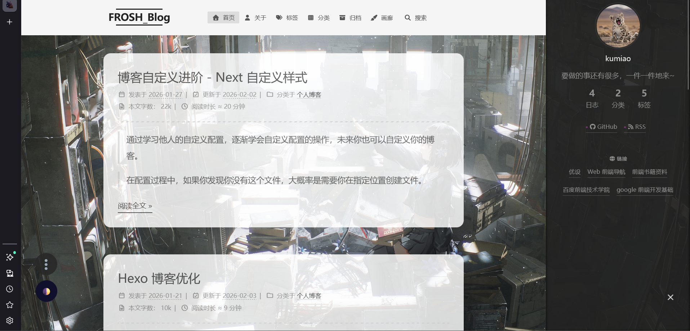

# Next For Frosh

> 该仓库由Frosh定制，存储着由Hexo已生成的前端文件。



一个基于Hexo构建的个人博客主题，记录自己。
博客地址：[FROSH_Blog](frosh.qzz.io)


## 实现原理

>实现架构：Hexo + GitHub + GitHub Pages + Could Flare CND（优选）

Hexo：静态博客框架，生成前端文件。
GitHub：代码托管平台，存储前端文件
GitHub Pages：平台免费的静态网页托管服务
Could Flare CDN：赛博大善人，平台提供许多好用的免费服务，其中CDN是加速网站访问速度，增强网站安全性。
>Could Flare的CDN在国内也被称为"减速器"，需要做优选。

## 关于博客

>Hexo version：8.1.1，Next version：8.27.0；
>样式：Mist

**主要设置：**
- 布局变化：页脚居中
- 网站运行时间
- 添加有色卡片
- 明暗主题切换
- 进度显示和回到顶部按钮
- 背景图添加
- 博客压缩

### 本地部署

[Hexo博客搭建](https://frosh.qzz.io/posts/be06e9d8.html/#more)
## 使用指南
### 创建新文章
使用内置脚本快速创建文章：
```shell
hexo new helloword
```
### 清理缓存文件
```shell
hexo clean
```
### 生成静态文件
```shell
hexo generate 
```

### 部署网站
```shell
hexo deploy
```